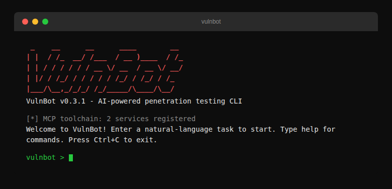

<div align="center">

# VulnBot 🦞

> *AI-Powered Penetration Testing CLI — Speak plainly, find real bugs.*

[](LICENSE)
[](https://www.python.org/)
[](https://platform.openai.com/)
[](https://modelcontextprotocol.io/)
[](https://pypi.org/project/vulnbot/)
[](#-security-notice)
<br>

**This project is a standalone AI penetration testing Agent.**

**Public alpha:** VulnBot is public alpha software for authorized security
testing, CTFs, labs, and controlled research. It is not a production security
control or a replacement for human authorization, scoping, review, or reporting.
See [SECURITY.md](SECURITY.md) before using or reporting security issues.

<br>

Built on LLM Agent + MCP Toolchain + Pentest Skill orchestration,
compatible with OpenAI / MiniMax / DeepSeek and similar models.
Natural language input → automated "Recon → Vulnerability Discovery → Exploitation → Reporting".

[Quick Start](#quick-start) · [Architecture](#-architecture) · [Skills](#-built-in-skills)

</div>

> **ℹ️ About this build — VulnBot.** This package (`vulnbot`) is a combined
> product that merges [Vulnbot](https://github.com/Unclecheng-li/Vulnbot)
> (base: agent core, MCP toolchain, skills, CLI/TUI/web) with intelligence
> modules ported from [HackBot](https://github.com/yashab-cyber/hackbot)
> (CVE, OSINT, topology, compliance/MITRE, findings scoring, remediation, PDF).
> Both upstreams are MIT-licensed; see [`NOTICE`](NOTICE). User-facing branding
> is being unified incrementally.

---

## What It Does

Give it a natural language command and watch it run a full pentest:

```
User:   "Run a penetration test on http://target.example.com"

VulnBot executes:
  Round 1:  Recon → Fingerprinting, port scan, directory enumeration
  Round 2:  Vulnerability Discovery → Injection points, known CVEs, misconfigs
  Round 3:  Exploitation → PoC verification, access obtained
  Round 4:  Reporting → Structured report + Python PoC script
```



Suitable for authorized pentests, CTF competitions, security training, and red team operations.

---

## Features

- **Natural Language Driven** — Describe your intent in plain English, it auto-identifies phases and tools
- **8 LLM Providers** — OpenAI / MiniMax / DeepSeek / Zhipu / Moonshot / Qwen / SiliconFlow, one-command switch
- **MCP Toolchain** — Ships with 11 MCP service configs and 23 tool definitions; `fetch` / `memory` currently run in stable `local` mode, while most other MCP integrations remain preview or placeholder until full session lifecycle management is completed
- **AI Agent Core** — OpenAI-compatible protocol + Tool Calling + autonomous pentest loop
- **21 Pentest Skills** — 7 core + 14 specialized skills (incl. CTF Web/Crypto/Misc, osint-recon, secknowledge-skill), 180 reference documents
- **Encode/Decode & Crypto Tools** — 29 operations (Base64/Hex/URL/AES/JWT/Morse etc.), LLM calls them directly, no guessing
- **Python Code Execution** — Built-in `python_execute` tool for payload crafting and response parsing; currently still a high-risk experimental capability, not a strong isolation sandbox
- **Persistent Pentesting** — Cyclic runs (100 rounds/cycle × 10 cycles = 1000 rounds), auto-reports every cycle, runs until you stop it
- **Thinking Process Control** — `think on/off` toggles LLM reasoning visibility, off by default for clean output
- **REPL Parallel Auto-Mode** — Classic REPL auto prompts now use bounded child-agent fan-out by default; `parallel status/on/off/agents/reset` controls the current session without affecting one-off chat
- **Sandbox Mode Prompting** — Unlocks AI security testing capabilities, designed for CTF and authorized pentest scenarios
- **Auto Report & PoC** — Generates structured Markdown reports and runnable Python PoC scripts
- **Web UI Mode** — `vulnbot web` launches a local web interface for browser-based pentest operations, default `127.0.0.1:7788`
- **Security Knowledge Base** — Includes the KB module and baseline seed data today; retrieval augmentation is being integrated into the main workflow incrementally

---

## 🧠 Intelligence Tools (merged from HackBot)

VulnBot adds eight built-in **intel tools** the agent can call directly, ported
from [HackBot](https://github.com/yashab-cyber/hackbot) and rewritten for the
async/httpx stack. Read-only tools are classified as passive `recon` for the
constraint policy.

| Tool | What it does |
|------|--------------|
| `cve_lookup` | NVD CVE search (keyword or CVE-ID) with optional GitHub exploit/PoC discovery |
| `osint_recon` | Subdomain enumeration (crt.sh CT), DNS, RDAP/WHOIS, web tech fingerprinting, email candidates |
| `topology_build` | Parse nmap (text/XML) or masscan output into a host/port/service/subnet graph (markdown/ascii/json) |
| `compliance_map` | Map findings to PCI DSS v4.0 / NIST 800-53 / OWASP Top 10 / ISO 27001 with gap analysis |
| `findings_report` | Risk-score findings (severity breakdown, top risks, optional compliance coverage) |
| `findings_diff` | Diff two assessments — new / fixed / persistent findings and severity regressions |
| `remediation_advice` | Generate fix commands, config patches, and code snippets from a rule knowledge base |
| `attack_map` | Map findings (and tool usage) to MITRE ATT&CK techniques; export an ATT&CK Navigator layer |

Optional extras: `pip install vulnbot[osint]` (dnspython for richer DNS),
`pip install vulnbot[pdf]` (reportlab for PDF report export via
`vulnbot report ... --pdf`).

---

## Quick Start

### Installation

```bash
# Install from PyPI (recommended)
pip install vulnbot

# Install from source (VulnBot is built on the Vulnbot tree)
git clone https://github.com/Unclecheng-li/Vulnbot.git
cd Vulnbot
pip install -e .
```

### Four-Step Launch

```bash
# 1. Select provider (auto-fills Base URL and model name)
vulnbot config provider minimax   # or openai / deepseek / zhipu / moonshot / qwen / siliconflow

# 1.2 (optional) custom Base URL or model name
vulnbot config set llm.base_url https://your-own-api.example.com/v1
vulnbot config set llm.model your-model-name

# 2. Set API Key
vulnbot config set llm.api_key sk-your-key-here

# 3. Default: open the original CLI / REPL
vulnbot

# 4. Optional: open the TUI workbench
vulnbot tui
```

### Environment Check

```bash
vulnbot doctor
```

Sample output:

```
🦞 VulnBot Environment Check

  Python: 3.14.4
  Node.js: v24.14.1
  npx: installed
  nmap: installed

LLM Config:
  Provider: openai
  API Key: set
  Base URL: https://api.openai.com/v1
  Model: gpt-4o

MCP Services:
  fetch: enabled [P0]
  memory: enabled [P0]
  ...

✅ Ready. Run vulnbot to start.
```

---

## CLI Command Reference

Run `vulnbot --help` to see all available commands. For the full flag manual, use
`vulnbot manual`, `vulnbot manual <command>`, or `vulnbot --man`.

```bash
$ vulnbot --help

🦞 VulnBot — AI-powered penetration testing CLI

 Usage: vulnbot [OPTIONS] COMMAND [ARGS]...

 Options:
   --version  Show version and exit.
   --help     Show this message and exit.

 Commands:
   run           🚀 Full pentest in one shot
   persistent    🔄 Persistent pentesting (100 rounds/cycle)
   recon         🔍 Reconnaissance only (no exploitation)
   scan          🔎 Vulnerability scanning
   network-scan  🛰️  Nmap network scan + weak-link follow-up
   exploit       💥 Exploitation phase
   report        📝 Generate report from session JSON
   repl          💬 Start the classic REPL
   config        ⚙️  Manage config (set/get/list/provider)
   init          🔧 Initialize configuration
   doctor        🏥  Check runtime environment
   manual        📖  Full CLI manual with flag explanations
   man           📖  Alias for manual
   tui           🖥️  Open the terminal UI workbench
   web           🌐 Launch local Web UI
```

### Command Reference

| Command | Description | Example |
|---------|-------------|---------|
| `vulnbot` | Open the original CLI / REPL by default | `vulnbot` |
| `vulnbot tui` | Explicitly open the terminal UI workbench | `vulnbot tui` / `vulnbot tui --target target.com` |
| `vulnbot repl` | Start the classic REPL interactive shell | `vulnbot repl` |
| `vulnbot run <target>` | Full pentest in one shot | `vulnbot run 192.168.1.1` |
| `vulnbot persistent <target>` | Persistent pentesting | `vulnbot persistent 192.168.1.1` |
| `vulnbot recon <target>` | Reconnaissance only | `vulnbot recon target.com` |
| `vulnbot scan <target>` | Vulnerability scanning | `vulnbot scan target.com --ports 80,443` |
| `vulnbot network-scan [target]` | Nmap scan, weak-link ranking, safe follow-up probes. Defaults to connected Wi-Fi subnet. Use `--parallel-agents N` for bounded worker fan-out across discovered surfaces. | `vulnbot network-scan --profile fast --parallel-agents 3` |
| `vulnbot exploit <target>` | Exploitation phase | `vulnbot exploit target.com --cve CVE-2024-1234` |
| `vulnbot report <session>` | Generate report from session | `vulnbot report session_xxx.json` |
| `vulnbot config set <key> <value>` | Set a config value | `vulnbot config set llm.api_key sk-xxx` |
| `vulnbot config get <key>` | View a config value | `vulnbot config get llm.model` |
| `vulnbot config list` | List all config | `vulnbot config list` |
| `vulnbot config provider <name>` | Switch LLM provider | `vulnbot config provider deepseek` |
| `vulnbot init` | Initialize config files | `vulnbot init` |
| `vulnbot doctor` | Check runtime environment | `vulnbot doctor` |
| `vulnbot manual [command]` | Full CLI manual with flag explanations | `vulnbot manual network-scan` / `vulnbot --man` |
| `vulnbot web` | Launch local Web UI | `vulnbot web` / `vulnbot web --port 8080` |

### TUI Workbench

`vulnbot tui` is the optional terminal UI workbench entry. It shows the authorized target, check mode, runtime overview, safety boundary, command preview, target history, report entry, and inline environment diagnostics before a task starts.

```bash
vulnbot tui
vulnbot tui --target https://target.example --mode quick --only-port 443
vulnbot tui --dry-run --target https://target.example --mode deep --only-path /admin
```

The default `vulnbot` command still opens the original CLI / REPL. The TUI opens only when users explicitly run `vulnbot tui`.
The runtime overview reads the selected target's snapshots, finding counts, persisted constraints, and blocked constraint violations so users can confirm context before continuing.
The TUI "Set testing scope" flow can edit allowed actions and blocked actions directly, for example allowing only `recon,scan` or blocking `exploit,post_exploitation`.

### Provider Configuration

```bash
# List all providers and switch
vulnbot config provider --list    # list all available providers
vulnbot config provider minimax   # switch to MiniMax

# Manual setup (custom mode)
vulnbot config set llm.base_url https://your-api.com/v1
vulnbot config set llm.model your-model-name
vulnbot config set llm.api_key sk-your-key
```

---

## Usage

### Mode 1: Original CLI / REPL Interactive Mode (Default)

```bash
$ vulnbot
```

No-args startup opens the original 🦞 interactive shell for natural-language use:

```text
🦞 vulnbot> pentest 192.168.1.100 — this is my authorized lab

[*] Entering autonomous pentest mode. Press Ctrl+C to interrupt at any time.
── Round 1 ──
  [+] Target: 192.168.1.100
  [+] Open ports: 22, 80, 443, 8080
```

### Mode 2: TUI Workbench (Explicit)

```bash
$ vulnbot tui
```

The TUI shows target, mode, runtime overview, and safety boundary before launching a task:

```text
VulnBot TUI Workbench

Authorized target    https://example.com
Check mode           Quick recon / recon
Runtime overview     history snapshots, findings, persisted constraints
Safety boundary      only port 443, block exploit/persistent/post_exploitation

1 Set authorized target
2 Choose check mode
3 Set testing scope
4 Start authorized security check
8 Model/API settings
```

Common launch examples:

```bash
vulnbot tui
vulnbot tui --target https://target.example --mode quick --only-port 443
vulnbot tui --dry-run --target https://target.example --mode deep --only-path /admin
```

Menu item 3, "Set testing scope", edits host, port, path, exclusions, allowed actions, and blocked actions. These boundaries are shown in the pre-launch confirmation and passed into the actual task command.
Menu item 7, "Environment diagnostics", shows Python, Node/npx/uvx/nmap, LLM configuration, and MCP service/tool summaries inside the TUI. Run `vulnbot doctor` only when you need the full details.
Menu item 8, "Model/API settings", switches Provider, Base URL, Model, and API Key directly in the workbench. Saved changes are used by the current TUI session immediately.

### Mode 3: Classic REPL Subcommand

```bash
$ vulnbot repl
```

Enter the classic 🦞 interactive shell and chat in natural language:

Auto-mode prompts in the REPL now use bounded parallel child-agent fan-out by default. Use `parallel status`, `parallel off`, `parallel agents 2`, or `parallel reset` to control the current session without changing single-turn chat.

```
🦞 vulnbot> pentest 192.168.1.100 — this is my authorized lab

[*] Entering autonomous pentest mode. Press Ctrl+C to interrupt at any time.
── Round 1 ──
  [+] Target: 192.168.1.100
  [+] Open ports: 22, 80, 443, 8080
  [+] Web fingerprint: Apache/2.4.62
── Round 2 ──
  [+] Discovered /manager/html (Tomcat Manager)
  [+] Matched CVE-202X-XXXX: Apache Tomcat Auth Bypass
── Round 3 ──
  [+] Vulnerability verified

🦞 192.168.1.100 | report> generate pentest report
[+] Report saved: ./reports/192.168.1.100_20260418.md
[+] PoC saved: ./pocs/CVE-202X-XXXX.py
```

#### Classic REPL Built-in Commands

| Command             | Description                                             |
| ------------------- | ------------------------------------------------------- |
| `target <host>`     | Set pentest target                                      |
| `status`            | View current state (target, phase, tools, thinking)    |
| `tools`             | List available MCP tools                               |
| `parallel`          | Show or tune REPL auto-mode fan-out                    |
| `think`             | Toggle thinking process display                         |
| `think on` / `off`  | Explicitly control thinking visibility                  |
| `persistent`        | Start persistent pentesting (100 rounds/cycle)         |
| `persistent <host>` | Start persistent pentest on a target                   |
| `clear`             | Clear current session                                  |
| `help`              | Show help                                              |
| `exit` / `quit` / `q` | Exit VulnBot                                       |

#### Autonomous Pentest Mode

VulnBot auto-enters multi-round autonomous loop when it detects these keywords + a target:

| Trigger               | Example                                             |
| --------------------- | --------------------------------------------------- |
| Pentest command       | `pentest http://target.com`                        |
| CTF / find flag      | `find the flag on http://ctf.site`                |
| Brute / bypass       | `bruteforce weak credentials on http://target.com` |
| **Explicit**          | `target: http://target.com, enter autonomous mode` |

> 💡 Press `Ctrl+C` to interrupt the autonomous loop at any time. Switching targets automatically resets session context.

### Mode 2: Single Command

```bash
# Full pentest in one shot
vulnbot run 192.168.1.100

# Persistent pentesting (100 rounds/cycle × 10 cycles, auto-report)
vulnbot persistent 192.168.1.100

# Custom cycle parameters
vulnbot persistent 192.168.1.100 --rounds 200 --cycles 5

# Recon only
vulnbot recon 192.168.1.100

# Vulnerability scan (specify ports)
vulnbot scan 192.168.1.100 --ports 80,443,8080

# Network scan with weak-link prioritization (safe probes by default)
vulnbot network-scan --profile adaptive
vulnbot network-scan 192.168.1.100 --profile thorough --ports 1-1000
vulnbot network-scan --profile fast --parallel-agents 3 --parallel-depth 2 --worker-rounds 3

# Exploitation (specify CVE)
vulnbot exploit 192.168.1.100 --cve CVE-2024-1234 --cmd id

# Generate report
vulnbot report session.json
```

### Mode 3: Persistent Pentest

For long-running deep penetration. VulnBot runs in **cyclic loops**:

```
┌──────────────────────────────────────────────┐
│  Cycle 1 (100 rounds) → auto-report → continue │
│  Cycle 2 (100 rounds) → auto-report → continue │
│  Cycle 3 (100 rounds) → auto-report → continue │
│  ...                                             │
│  Until Ctrl+C or max cycles reached (default 10) │
└──────────────────────────────────────────────┘
```

**Features**:
- **Cross-cycle state** — Each cycle preserves all previous findings, vulnerabilities, and step records
- **Cycle reports** — Auto-generates independent Markdown report per cycle (new findings + cumulative summary)
- **Graceful interrupt** — Ctrl+C at any time still generates the current cycle's report
- **Incremental discovery** — Reports distinguish "new this cycle" from "cumulative total"
- **Fully configurable** — Rounds per cycle, max cycles, auto-report toggle all customizable

```bash
# CLI mode
vulnbot persistent 192.168.1.100              # default: 100 rounds/cycle × 10 cycles
vulnbot persistent 192.168.1.100 -r 200 -c 5  # 200 rounds/cycle × 5 cycles
vulnbot persistent 192.168.1.100 --no-report   # disable auto-report

# TUI mode
vulnbot tui --target 192.168.1.100 --mode continuous

# REPL mode
🦞 vulnbot> target 192.168.1.100
🦞 vulnbot> persistent
# or directly
🦞 vulnbot> persistent 192.168.1.100
```

### Mode 4: Web UI

Operate the full pentest workflow through a browser — ideal for users who prefer a graphical interface.

```bash
# Install Web dependencies
pip install vulnbot[web]

# Launch Web UI (default: 127.0.0.1:7788)
vulnbot web

# Custom port
vulnbot web --port 8080

# Dry-run (validate launch info without starting the server)
vulnbot web --dry-run
```

Once launched, open `http://127.0.0.1:7788` in your browser.

> ⚠️ By default the server binds to localhost only. To allow remote access you must explicitly pass `--host 0.0.0.0 --allow-remote` — make sure your network is secure.

---

## LLM Provider Configuration

VulnBot supports all OpenAI-compatible APIs with 8 built-in provider presets:

```bash
vulnbot config provider --list    # list all providers
vulnbot config provider minimax   # one-command switch
```

| Provider     | Command                  | Default Model          |
| ------------ | ------------------------ | ---------------------- |
| OpenAI      | `provider openai`        | gpt-4o                 |
| MiniMax     | `provider minimax`       | MiniMax-M3             |
| DeepSeek    | `provider deepseek`      | deepseek-v4-pro        |
| Zhipu GLM   | `provider zhipu`         | glm-4.7                |
| Kimi        | `provider moonshot`      | kimi-k2.6              |
| Qwen        | `provider qwen`          | qwen3-max              |
| SiliconFlow | `provider siliconflow`   | DeepSeek-V4-Flash      |
| Doubao      | `provider doubao`        | Doubao-Seed-2.0-Pro    |
| Baichuan    | `provider baichuan`      | Baichuan4-Turbo        |
| StepFun     | `provider stepfun`       | step-3.5-flash         |
| SenseTime   | `provider sensetime`     | SenseNova-6.7-Flash-Lite |
| Yi          | `provider yi`            | yi-lightning           |
| Custom      | `provider custom`        | manual                 |

---

## Architecture

```
┌─────────────────────────────────────────────┐
│                   VulnBot CLI                   │
│  ┌─────────┐  ┌─────────┐  ┌────────────┐  │
│  │ Natural  │  │  Task   │  │  Report    │  │
│  │ Language │  │Orchestr.│  │ & PoC Gen  │  │
│  │Interface │  │ Engine  │  │            │  │
│  └────┬────┘  └────┬────┘  └─────┬──────┘  │
│       └─────────────┼─────────────┘          │
│               ┌─────▼──────┐                 │
│               │ LLM Agent  │                 │
│               │(Jailbreak+  │                 │
│               │  Skills)    │                 │
│               └─────┬──────┘                 │
│               ┌─────▼──────┐                 │
│               │ MCP Layer  │                 │
│               │ (11 Svcs)  │                 │
│               └─────┬──────┘                 │
│               ┌─────▼──────┐                 │
│               │ Security    │                 │
│               │ Knowledge   │                 │
│               └────────────┘                 │
└─────────────────────────────────────────────┘
```

### Core Modules

| Module              | File                                                  | Description                                        |
| ------------------- | ----------------------------------------------------- | -------------------------------------------------- |
| **CLI/TUI Entry**   | `cli/main.py` + `cli/tui.py`                         | Typer commands + default original CLI/REPL + explicit TUI |
| **Agent Core**      | `agent/core.py`                                      | AgentCore coordination entrypoint (after the refactor it mainly keeps thin coordination responsibilities) |
| **Dynamic Prompts** | `agent/prompts.py`                                   | Base identity + core contract + skills + MCP tools  |
| **Prompt Assembly** | `agent/system_prompt.py` + `prompt_context.py`       | System prompt / round context / attack summary assembly |
| **Input Analysis**  | `agent/input_analysis.py`                            | Target detection, phase detection, explicit vuln-hint extraction |
| **Anti-loop / CTF** | `agent/anti_loop.py` + `ctf_mode.py`                | Completion signals, attack-path heuristics, failed-target tracking, flag state machine |
| **Session State**   | `agent/context.py`                                   | Phase tracking + findings + step records            |
| **Skill / KB Context** | `agent/skill_context.py` + `kb_context.py`       | Skill selection and knowledge-base prompt injection |
| **Target State**    | `target_state/store.py`                              | Per-target persistence, resume, snapshots, rollback, target-level reports |
| **MCP Orchestration**| `mcp/registry.py` + `lifecycle.py` + `router.py`    | Service registry + lifecycle + NL→tool routing     |
| **Skill Dispatcher** | `skills/loader.py` + `dispatcher.py`               | Directory-format Skills + CTF/SRC/AI/Web intent routing |
| **Crypto Tools**    | `skills/crypto_tools.py`                             | 29 encode/decode/crypto ops, registered as built-in tools |
| **Config**          | `config/schema.py` + `settings.py`                   | Pydantic models + YAML persistence + 8 provider presets |
| **Report Generator** | `report/generator.py` + `poc_builder.py`          | Markdown reports + Python PoC templates             |
| **Security KB**     | `kb/store.py` + `retriever.py`                     | JSON storage + CVE/technique/tool retrieval        |

---

## MCP Toolchain

| MCP Service         | Tools | Use Case                    | Priority |
| ------------------- | ----- | ---------------------------- | ------- |
| fetch              | 1     | HTTP requests, API testing    | P0      |
| memory             | 2     | Context memory, state persist | P0      |
| chrome-devtools    | 4     | Browser automation            | P0      |
| js-reverse         | 2     | JavaScript reversing          | P0      |
| burp               | 2     | HTTP interception & replay    | P0      |
| frida-mcp          | 2     | Mobile Hook                   | P1      |
| adb-mcp            | 3     | Android device control        | P1      |
| jadx               | 2     | APK decompilation             | P1      |
| ida-pro-mcp        | 2     | Binary reversing              | P1      |
| sequential-thinking| 1     | Complex reasoning chains       | P1      |
| context7           | 1     | Code context retrieval        | P1      |
| everything-search   | 1     | Local file search             | P2      |

> 11 MCP services, 23 tool definitions total. Plus 3 built-in Agent tools (`load_skill_reference` + `crypto_decode` + `python_execute`) callable without MCP.
>
> `fetch` / `memory` currently run in stable `local` mode; most other services remain `preview / placeholder`. Full MCP protocol access will be restored and expanded after a dedicated session lifecycle manager is introduced.

---

## Built-in Skills

### Core Skills (7)

| Skill              | Description                         |
| ------------------ | ----------------------------------- |
| pentest-flow       | Full pentest workflow orchestration  |
| recon              | Information gathering               |
| vuln-discovery     | Vulnerability discovery              |
| exploitation       | Exploitation                       |
| post-exploitation  | Post-exploitation                  |
| reporting          | Report generation                  |
| waf-bypass        | WAF bypass techniques              |

### Specialized Skills (14)

| Skill                      | Ref Docs | Description                                          |
| -------------------------- | -------- | ---------------------------------------------------- |
| web-pentest                | 4        | Web application pentesting                            |
| android-pentest            | 9        | Android application pentesting                        |
| client-reverse            | 20       | Client-side reverse engineering                      |
| web-security-advanced      | 34       | Advanced web security (injection, bypass, chains)     |
| ai-mcp-security            | 7        | AI/MCP security testing                              |
| intranet-pentest-advanced  | 15       | Advanced internal network pentesting                  |
| pentest-tools              | 18       | Pentest tool quick reference                         |
| rapid-checklist            | 3        | Rapid validation checklists                          |
| crypto-toolkit             | 3        | Encode/decode/crypto (29 ops, registered as built-in)|
| ctf-web                   | 9        | CTF Web attacks (PHP bypass/RCE/SSTI/deserialization)|
| ctf-crypto                | 6        | CTF cryptography (RSA/AES/ECC/PRNG/lattice attacks)  |
| ctf-misc                  | 6        | CTF Misc (PyJail/BashJail/encoding chains/VM RE)    |
| osint-recon               | 7        | OSINT four-dimension model (server/web/domain/person)|
| secknowledge-skill        | 39       | Web+AI security testing knowledge base for CTF/SRC/bug bounty workflows |

Skills are auto-dispatched based on user input — no manual selection needed. Specialized skills include detailed methodology documents in `references/`, loadable via the `load_skill_reference` tool.

`secknowledge-skill` integrates [`Pa55w0rd/secknowledge-skill`](https://github.com/Pa55w0rd/secknowledge-skill). All 38 upstream `references/` documents are included, plus VulnBot's `vulnbot-ctf-src-routing.md` guide for CTF/SRC workflows. It is routed by strong signals such as `SRC`, vulnerability research, bug bounty, GAARM, OWASP LLM/ASI/WSTG, and Web+AI testing, then loads SQLi, XSS, RCE, SSRF, AI/MCP, Agent, risk-matrix, and methodology references on demand.

### Built-in Encode/Decode & Crypto Tool (`crypto_decode`)

Registered as a built-in Agent tool, callable in any context — no more guessing at decoded output:

| Category  | Operations                                                                                   |
| --------- | -------------------------------------------------------------------------------------------- |
| Encoding  | base64, base32, base58, hex, url, html, unicode, rot13, caesar, morse (each with encode/decode) |
| Hashing   | md5, sha1, sha256, sha512                                                                   |
| Encrypt   | aes_encrypt, aes_decrypt (CBC mode, PKCS7 padding)                                          |
| JWT       | jwt_decode, jwt_encode                                                                      |
| Auto      | auto_decode — tries all common encodings, returns matching results                            |

---

## Configuration

### CLI Configuration

```bash
vulnbot config list                          # view all settings
vulnbot config get llm.model                 # view single setting
vulnbot config set llm.api_key sk-xx         # set API key
vulnbot config set session.max_rounds 30     # set max autonomous rounds (default 15)
vulnbot config set session.stale_rounds_threshold 8  # set dead-loop threshold (default 5)
vulnbot config set session.show_thinking false  # hide thinking process (also in REPL: think off)
vulnbot config set session.repl_parallel_enabled true  # enable REPL fan-out by default
vulnbot config set session.repl_parallel_agents 3      # default child-agent count
```

### Configurable Options

| Option                                  | Default        | Description                                      |
| --------------------------------------- | -------------- | ------------------------------------------------ |
| `llm.provider`                         | openai         | LLM provider (8 built-in + custom)              |
| `llm.api_key`                          | empty          | API key                                          |
| `llm.base_url`                         | per provider   | API base URL, customizable                       |
| `llm.model`                            | per provider   | Model name, customizable                        |
| `llm.temperature`                      | 0.1            | Sampling temperature                             |
| `llm.max_tokens`                       | 4096           | Max output tokens per call                       |
| `session.max_rounds`                    | 15             | Max rounds per autonomous pentest (10-50 recommended)|
| `session.output_dir`                    | ./vulnbot-output | Report output directory                    |
| `session.report_format`                  | markdown       | Report format (markdown / html)                |
| `session.poc_language`                  | python         | PoC generation language (python / bash)          |
| `session.show_thinking`                 | false          | Show LLM reasoning (think tag content, default off)|
| `session.repl_parallel_enabled`         | true           | Use bounded parallel fan-out by default in REPL auto-mode |
| `session.repl_parallel_agents`          | 3              | Child-agent count used for REPL auto-mode fan-out  |
| `session.repl_parallel_depth`           | 1              | Parallel discovery depth for REPL auto-mode        |
| `session.repl_parallel_worker_rounds`   | 3              | Rounds per child agent in REPL auto-mode           |
| `session.repl_parallel_surface_limit`   | 20             | Max discovered surfaces considered for REPL fan-out |
| `session.persistent_rounds_per_cycle`   | 100            | Rounds per cycle in persistent mode              |
| `session.persistent_max_cycles`        | 10             | Max cycles in persistent mode (0=unlimited)     |
| `session.persistent_auto_report`        | true           | Auto-generate report after each cycle            |
| `session.stale_rounds_threshold`        | 5              | Dead-loop threshold — triggers forced strategy switch after this many rounds with no new findings |

### Environment Variables

| Variable                                        | Description              |
| ----------------------------------------------- | ---------------------- |
| `VULNBOT_LLM_PROVIDER`                       | LLM provider name      |
| `VULNBOT_LLM_API_KEY`                        | API key                |
| `VULNBOT_LLM_BASE_URL`                       | API base URL           |
| `VULNBOT_LLM_MODEL`                          | Model name             |
| `VULNBOT_SESSION_MAX_ROUNDS`                 | Max autonomous rounds  |
| `VULNBOT_SESSION_SHOW_THINKING`              | Show or hide thinking output |
| `VULNBOT_SESSION_REPL_PARALLEL_ENABLED`      | Enable REPL parallel auto-mode |
| `VULNBOT_SESSION_REPL_PARALLEL_AGENTS`       | Child-agent count for REPL auto-mode |
| `VULNBOT_SESSION_REPL_PARALLEL_DEPTH`        | Discovery depth for REPL auto-mode |
| `VULNBOT_SESSION_REPL_PARALLEL_WORKER_ROUNDS`| Rounds per REPL child worker |
| `VULNBOT_SESSION_REPL_PARALLEL_SURFACE_LIMIT`| Surface cap for REPL fan-out |

Priority: **Environment Variables > Config File > Built-in Defaults**

Config file location: `~/.vulnbot/config.yaml`.

---

## Security Notice

VulnBot is intended **solely for authorized security testing**. Before using this tool, ensure:

1. You have **explicit authorization** for the target system
2. Scope has been **confirmed in writing** with the target owner
3. You comply with all applicable **local laws and regulations**

Unauthorized penetration testing is illegal. The author assumes no liability for misuse.

---

## License

[MIT License](LICENSE)

---

## Join the Community

Connect with security enthusiasts to share, learn, and grow together.

| Community Group | Developer Group |
|:--:|:--:|
| Join discussions and get the latest product updates and usage tips | Join us for open-source contributions and deep technical discussions |
|  |  |
| **QQ Group: 954402631** | **QQ Group: 1065858551** |

---

<div align="center">

> 🦞 **VulnBot** — Every pentest should follow a process.

</div>
